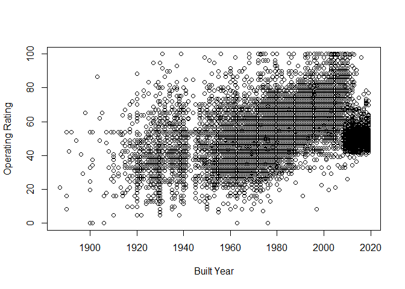
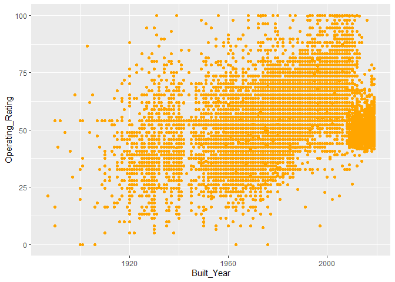

HW1
================
SHUYUAN
9/19/2021

## R Markdown

This is an R Markdown document. Markdown is a simple formatting syntax
for authoring HTML, PDF, and MS Word documents. For more details on
using R Markdown see <http://rmarkdown.rstudio.com>.

When you click the **Knit** button a document will be generated that
includes both content as well as the output of any embedded R code
chunks within the document. You can embed an R code chunk like this:

``` r
library("readxl")
```

    ## Warning: package 'readxl' was built under R version 4.0.5

``` r
my_data <- read_excel("C:/Users/Megan Jia/Documents/WI20.xlsx")
```

    ## Warning in read_fun(path = enc2native(normalizePath(path)), sheet_i = sheet, :
    ## Expecting numeric in CU5801 / R5801C99: got '55200040000B010'

    ## Warning in read_fun(path = enc2native(normalizePath(path)), sheet_i = sheet, :
    ## Expecting numeric in BT11308 / R11308C72: got 'F'

    ## Warning in read_fun(path = enc2native(normalizePath(path)), sheet_i = sheet, :
    ## Expecting numeric in BV11308 / R11308C74: got 'F'

``` r
head(my_data)
```

    ## # A tibble: 6 x 123
    ##   STATE_CODE_001 STRUCTURE_NUMBER_008 RECORD_TYPE_005A ROUTE_PREFIX_005B
    ##            <dbl> <chr>                           <dbl>             <dbl>
    ## 1             55 00000000000F303                     1                 6
    ## 2             55 00000000000F304                     1                 6
    ## 3             55 00000000000F310                     1                 6
    ## 4             55 00000000000F311                     1                 6
    ## 5             55 00000000000F315                     1                 6
    ## 6             55 00000000000F317                     1                 6
    ## # ... with 119 more variables: SERVICE_LEVEL_005C <dbl>,
    ## #   ROUTE_NUMBER_005D <chr>, DIRECTION_005E <dbl>, HIGHWAY_DISTRICT_002 <chr>,
    ## #   COUNTY_CODE_003 <dbl>, PLACE_CODE_004 <dbl>, FEATURES_DESC_006A <chr>,
    ## #   CRITICAL_FACILITY_006B <lgl>, FACILITY_CARRIED_007 <chr>,
    ## #   LOCATION_009 <chr>, MIN_VERT_CLR_010 <dbl>, KILOPOINT_011 <dbl>,
    ## #   BASE_HWY_NETWORK_012 <dbl>, LRS_INV_ROUTE_013A <chr>,
    ## #   SUBROUTE_NO_013B <dbl>, LAT_016 <dbl>, LONG_017 <dbl>, ...

``` r
my_data['YEAR_BUILT_027']
```

    ## # A tibble: 14,271 x 1
    ##    YEAR_BUILT_027
    ##             <dbl>
    ##  1           1932
    ##  2           1974
    ##  3           1948
    ##  4           1979
    ##  5           1977
    ##  6           1980
    ##  7           1980
    ##  8           1994
    ##  9           1999
    ## 10           2006
    ## # ... with 14,261 more rows

``` r
# Build year
```

``` r
my_data['STRUCTURE_NUMBER_008']
```

    ## # A tibble: 14,271 x 1
    ##    STRUCTURE_NUMBER_008
    ##    <chr>               
    ##  1 00000000000F303     
    ##  2 00000000000F304     
    ##  3 00000000000F310     
    ##  4 00000000000F311     
    ##  5 00000000000F315     
    ##  6 00000000000F317     
    ##  7 00000000000F318     
    ##  8 00000000000F321     
    ##  9 00000000000F323     
    ## 10 00000000000F324     
    ## # ... with 14,261 more rows

``` r
# Bridge ID
```

``` r
my_data['COUNTY_CODE_003']
```

    ## # A tibble: 14,271 x 1
    ##    COUNTY_CODE_003
    ##              <dbl>
    ##  1              51
    ##  2              51
    ##  3             115
    ##  4             115
    ##  5               3
    ##  6               3
    ##  7               3
    ##  8             115
    ##  9               3
    ## 10               3
    ## # ... with 14,261 more rows

``` r
# OPERATING_RATING_064
# fips codes
```

``` r
# Conditional Ratings
# Items 58 through 62 - Indicate the Condition Ratings
#DECK_COND_058
#SUPERSTRUCTURE_COND_059
#SUBSTRUCTURE_COND_060
```

``` r
#DETOUR_KILOS_019
```

``` r
df <- data.frame (col_1 = my_data['STRUCTURE_NUMBER_008'],
                  col_2 = my_data['YEAR_BUILT_027'],
                  col_3 = my_data['COUNTY_CODE_003'],
                  col_4 = my_data['DECK_COND_058'],
                  col_5 = my_data['SUPERSTRUCTURE_COND_059'],
                  col_6 = my_data['SUBSTRUCTURE_COND_060'],
                  col_7 = my_data['OPERATING_RATING_064'])

colnames(df) <- c('Bridge_ID','Built_Year','County_Code','Deck_Cond',
                  'Superstructure_Cond','Substructure_Cond','Operating_Rating')

write.csv(df,'WI_Bridge_data.csv')
```

``` r
data = read.csv('WI_Bridge_data.csv')
```

``` r
plot(data$Built_Year,data$Operating_Rating,xlab='Built Year',ylab='Operating Rating')
```

<!-- -->

``` r
library(ggplot2)
```

    ## Warning: package 'ggplot2' was built under R version 4.0.5

``` r
ggplot(data, aes(x=Built_Year, y=Operating_Rating)) + geom_point(color='orange')
```

    ## Warning: Removed 14 rows containing missing values (geom_point).

<!-- -->

``` r
# 'Superstructure_Cond','Substructure_Cond','Operating_Rating'
model=lm(data$Operating_Rating ~ data$Superstructure_Cond+data$Substructure_Cond+data$Deck_Cond+data$Built_Year)
model
```

    ## 
    ## Call:
    ## lm(formula = data$Operating_Rating ~ data$Superstructure_Cond + 
    ##     data$Substructure_Cond + data$Deck_Cond + data$Built_Year)
    ## 
    ## Coefficients:
    ##               (Intercept)  data$Superstructure_Cond1  
    ##                 -355.8975                    32.0135  
    ## data$Superstructure_Cond2  data$Superstructure_Cond3  
    ##                   31.3672                    28.2028  
    ## data$Superstructure_Cond4  data$Superstructure_Cond5  
    ##                   32.6052                    36.5565  
    ## data$Superstructure_Cond6  data$Superstructure_Cond7  
    ##                   37.8014                    40.6562  
    ## data$Superstructure_Cond8  data$Superstructure_Cond9  
    ##                   41.9754                    38.8151  
    ## data$Superstructure_CondN    data$Substructure_Cond1  
    ##                   33.8986                   -37.9444  
    ##   data$Substructure_Cond2    data$Substructure_Cond3  
    ##                  -22.7123                   -12.1421  
    ##   data$Substructure_Cond4    data$Substructure_Cond5  
    ##                  -12.8566                    -8.8741  
    ##   data$Substructure_Cond6    data$Substructure_Cond7  
    ##                   -8.7498                    -6.1853  
    ##   data$Substructure_Cond8    data$Substructure_Cond9  
    ##                   -6.6576                   -12.6077  
    ##   data$Substructure_CondN            data$Deck_Cond1  
    ##                        NA                    43.0821  
    ##           data$Deck_Cond2            data$Deck_Cond3  
    ##                   -4.8633                     5.8672  
    ##           data$Deck_Cond4            data$Deck_Cond5  
    ##                    1.9405                     3.0633  
    ##           data$Deck_Cond6            data$Deck_Cond7  
    ##                    5.1835                     5.6553  
    ##           data$Deck_Cond8            data$Deck_Cond9  
    ##                    1.8401                    -0.7562  
    ##           data$Deck_CondN            data$Built_Year  
    ##                        NA                     0.1894
